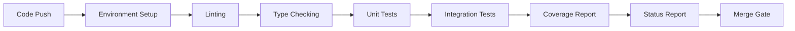

<div align="center">

# 🐍 ALX Backend Python
### Advanced Python Programming Specialization

<p align="center">
  
  
  
</p>

<p align="center">
  
  
  
</p>

```ascii
╔═══════════════════════════════════════════════════════════════════════╗
║                                                                       ║
║   Master Modern Python • Async Programming • Type Safety • Testing   ║
║                                                                       ║
╚═══════════════════════════════════════════════════════════════════════╝
```

**🚀 A comprehensive learning repository for mastering advanced Python backend development**

[Getting Started](#-quick-start) • [Features](#-core-functionalities) • [Documentation](#-table-of-contents) • [Resources](#-resources) • [License](#-license)

</div>

<br/>

<div align="center">

## 📜 Table of Contents

</div>

<table align="center">
<tr>
<td>

**📚 Learning Modules**
- [🎯 Quick Start](#-quick-start)
- [📋 Project Overview](#-project-overview)
- [✨ Core Functionalities](#-core-functionalities)
- [🧪 Testing Practices](#-comprehensive-testing-suite)

</td>
<td>

**🛠️ Technical Details**
- [🔑 Technology Stack](#-technology-stack-overview)
- [👥 Team Roles](#-team-roles-and-responsibilities)
- [🗄️ Database Design](#️-database-design-overview)
- [🔒 Security Measures](#-api-security-overview)

</td>
<td>

**📖 More Info**
- [🚀 CI/CD Pipeline](#-cicd-pipeline-overview)
- [📚 Resources](#-resources)
- [📄 License](#-license)
- [👨‍💻 Created By](#-created-by)

</td>
</tr>
</table>

<div align="center">

**[⬆ back to top](#-alx-backend-python)**

</div>

---

<br/>

## 🎯 Quick Start

<div align="center">

```bash
# Clone the repository
git clone https://github.com/MachariaP/alx-backend-python.git

# Navigate to project directory
cd alx-backend-python

# Explore the learning modules
ls -la
```

</div>

### 🏃 Run Your First Async Program

```python
import asyncio

async def say_hello():
    """Your first async function!"""
    await asyncio.sleep(1)
    return "Hello, Async World! 🚀"

# Run it
result = asyncio.run(say_hello())
print(result)  # Output: Hello, Async World! 🚀
```

### 📂 Project Structure

```
alx-backend-python/
│
├── 0x00-python_variable_annotations/    # 🔤 Type Annotations & Type Safety
├── 0x01-python_async_function/          # ⚡ Async/Await Patterns
├── 0x02-python_async_comprehension/     # 🔄 Async Generators & Comprehensions
├── 0x03-Unittests_and_integration_tests/ # 🧪 Testing Strategies
├── python-decorators-0x01/              # 🎨 Advanced Decorators
├── python-generators-0x00/              # 📦 Generator Patterns
├── python-context-async-perations-0x02/ # 🔧 Context Managers
└── messaging_app/                       # 💬 Real-world Application
```

<div align="center">

**[⬆ back to top](#-alx-backend-python)**

</div>

---

## 📋 Project Overview

### 📋 Brief Description

The **ALX Backend Python** project is a comprehensive educational repository designed to master advanced Python programming concepts with a focus on backend development. This specialization covers critical modern Python features including type annotations, asynchronous programming, async comprehensions, and professional testing practices. The project serves as a hands-on learning pathway for developers aiming to build scalable, type-safe, and production-ready Python applications.

The repository addresses common challenges in backend development such as handling concurrent operations efficiently, ensuring code quality through type safety, and implementing robust testing strategies. Each module progressively builds upon fundamental concepts, culminating in real-world applicable skills for building high-performance Python backend systems.

### 🎯 Project Goals

<table>
<tr>
<td align="center" width="33%">

#### 🔒 Type Safety
Master comprehensive type annotations using Python 3.7+ typing module to catch errors early

</td>
<td align="center" width="33%">

#### ⚡ Async Excellence
Learn async/await patterns, asyncio event loops, and concurrent task execution

</td>
<td align="center" width="33%">

#### 🧪 Testing Mastery
Develop expertise in unit testing, integration testing, mocking, and TDD

</td>
</tr>
<tr>
<td align="center" width="33%">

#### 📦 Generator Patterns
Utilize asynchronous generators for memory-efficient data processing pipelines

</td>
<td align="center" width="33%">

#### 📏 Code Quality
Follow PEP 8, write comprehensive documentation, and use mypy for type checking

</td>
<td align="center" width="33%">

#### 🚀 Performance
Understand runtime measurement, parallel execution, and profiling techniques

</td>
</tr>
</table>

### 🔑 Key Tech Stack

<div align="center">

| 🛠️ Technology | 📌 Version | 🎯 Purpose |
|:-------------|:-----------|:-----------|
|  | 3.7+ | Core programming language |
|  | Built-in | Concurrent programming |
|  | Latest | Static type analysis |
|  | Built-in | Testing framework |
|  | Latest | Version control |

</div>

<div align="center">

**[⬆ back to top](#-alx-backend-python)**

</div>

---

## 👥 Team Roles and Responsibilities

<details>
<summary><b>👉 Click to expand team structure</b></summary>

<br/>

| Role | Key Responsibility |
|------|-------------------|
| **🔧 Backend Developer** | Implement type-annotated Python functions, async coroutines, and business logic following best practices and design patterns |
| **🧪 QA Engineer / Test Specialist** | Design and implement comprehensive unit tests, integration tests, parameterized tests, and maintain test coverage standards |
| **🚀 DevOps Engineer** | Set up CI/CD pipelines, automate testing workflows, manage deployment strategies, and ensure code quality gates |
| **👁️ Code Reviewer / Technical Lead** | Review pull requests for code quality, enforce type safety standards, ensure documentation completeness, and mentor team members |
| **📝 Documentation Specialist** | Maintain technical documentation, code comments, README files, and ensure all modules/functions have proper docstrings |
| **⚡ Performance Engineer** | Profile async code performance, optimize concurrent operations, measure runtime efficiency, and identify bottlenecks |

</details>

<div align="center">

**[⬆ back to top](#-alx-backend-python)**

</div>

---

## 🔑 Technology Stack Overview

<details>
<summary><b>👉 Click to expand technology stack details</b></summary>

<br/>

| Technology | Purpose in the Project |
|-----------|----------------------|
| **Python 3.7+** | Core programming language providing modern features like type hints, async/await syntax, and advanced language capabilities |
| **typing module** | Enables type annotations for function signatures, variables, and complex types (List, Dict, Tuple, Union, Optional, Callable) to improve code quality and IDE support |
| **asyncio** | Asynchronous I/O framework for writing concurrent code using async/await syntax, managing event loops, and executing coroutines |
| **unittest** | Built-in Python testing framework for writing and organizing unit tests, providing test discovery, fixtures, and assertions |
| **unittest.mock** | Mocking library for isolating code under test by simulating external dependencies, APIs, databases, and network calls |
| **parameterized** | Library for creating parameterized tests to run the same test logic with multiple input datasets, reducing code duplication |
| **requests** | HTTP library for making API calls and handling web requests (used in GitHub client implementation for external API integration) |
| **mypy** | Static type checker that validates type annotations at development time, catching type errors before runtime |
| **pycodestyle** | PEP 8 style checker ensuring code follows Python's official style guide for consistency and readability |
| **functools** | Provides higher-order functions including decorators like @wraps and memoization utilities for performance optimization |
| **random** | Generates random numbers for simulating delays in async operations and testing probabilistic scenarios |
| **time** | Measures execution time and runtime performance of synchronous and asynchronous code blocks |

</details>

<div align="center">

**[⬆ back to top](#-alx-backend-python)**

</div>

---

## 🗄️ Database Design Overview

<details>
<summary><b>👉 Click to expand database design patterns</b></summary>

<br/>

### 🗄️ Key Entities

While this project is primarily focused on Python programming concepts rather than database operations, the codebase demonstrates data structure patterns that would typically map to database entities in a production system:

- **GithubOrg**: Represents GitHub organization data fetched from APIs (would map to an Organization table)
- **Repository**: Contains repository metadata including name, license information, and configuration (repos_payload fixtures)
- **TestPayload**: Structured test data mimicking API responses, demonstrating proper data modeling
- **NestedMap**: Hierarchical key-value structures representing complex data relationships

### 🔗 Relationships

In the context of the GitHub client implementation:

- **One GithubOrg has many Repositories**: A GitHub organization contains multiple repositories, demonstrating one-to-many relationships
- **One Repository has one License**: Each repository is associated with a license configuration (one-to-one relationship)
- **Data Nesting Pattern**: The `access_nested_map` utility demonstrates traversing hierarchical data structures, similar to navigating related database entities through foreign keys

**Note**: This is an educational project focused on Python concepts. In a production backend system, these entities would be stored in databases like PostgreSQL or MongoDB with proper ORM (SQLAlchemy/Django ORM) or ODM patterns, foreign key constraints, and indexed relationships.

</details>

<div align="center">

**[⬆ back to top](#-alx-backend-python)**

</div>

---

## ✨ Core Functionalities

- **🔤 Type Annotation System**: Comprehensive type hints for all functions including basic types (int, float, str, bool), complex types (List, Dict, Tuple, Union), and advanced patterns (Callable, TypeVar, Generic). Validates code with mypy ensuring type safety and preventing runtime type errors.

- **⚡ Asynchronous Coroutines**: Implementation of async functions using async/await syntax for non-blocking I/O operations. Includes basic async patterns, concurrent execution with asyncio.gather(), task creation with asyncio.create_task(), and runtime measurement for performance analysis.

- **🔄 Async Generators & Comprehensions**: Advanced patterns for memory-efficient data streaming using asynchronous generators that yield values over time. Includes async comprehensions for collecting data from async iterables, demonstrating Python's modern approach to handling streams of asynchronous data.

- **🧪 Comprehensive Testing Suite**: Professional-grade testing infrastructure with unit tests for isolated function testing, integration tests for end-to-end workflows, parameterized tests for multiple input scenarios, mocking external dependencies (HTTP requests, databases), and fixture management for test data.

- **📦 Utility Functions Library**: Reusable helper functions including nested map access for hierarchical data traversal, JSON fetching from remote URLs with error handling, memoization decorator for caching expensive computations, and generic type-safe functions using duck typing principles.

- **⏱️ Performance Measurement Tools**: Runtime analysis utilities measuring execution time of async operations, comparing concurrent vs sequential execution performance, calculating average execution times, and profiling async task overhead to optimize application performance.

- **🎯 GitHub API Client**: Real-world API integration demonstrating HTTP client patterns, organization data fetching, public repository listing, license checking, property memoization for caching, and comprehensive test coverage with mocked HTTP responses.

- **📝 Documentation Standards**: Every module, class, and function includes detailed docstrings following Python documentation conventions. Type hints serve as inline documentation, providing clear function signatures and improving IDE autocomplete capabilities.

<div align="center">

**[⬆ back to top](#-alx-backend-python)**

</div>

---

## 🔒 API Security Overview

<details>
<summary><b>👉 Click to expand security measures</b></summary>

<br/>

### 🔒 Security Measures

| Security Measure | Implementation & Importance |
|-----------------|---------------------------|
| **🛡️ Type Safety** | Type annotations and mypy validation prevent type confusion attacks and ensure data integrity by catching type mismatches at development time before they reach production |
| **✅ Input Validation** | All functions validate input parameters against expected types, ranges, and formats. Prevents injection attacks, buffer overflows, and malformed data from propagating through the system |
| **🔐 Secure API Communication** | Uses HTTPS for all external API calls (GitHub API integration). The requests library validates SSL certificates by default, preventing man-in-the-middle attacks |
| **🎭 Mocking External Services** | Test suite mocks all external HTTP calls and API dependencies, preventing accidental calls to production systems during testing and avoiding exposure of credentials |
| **📊 Error Handling** | Comprehensive exception handling for KeyError, ValueError, TypeError, and HTTP errors prevents information leakage through error messages and ensures graceful degradation |
| **🔄 Rate Limiting Awareness** | Code design considers API rate limits (GitHub API has request limits). Production implementations should include exponential backoff, request throttling, and quota monitoring |
| **🔑 Secrets Management** | No hardcoded credentials or API keys in codebase. Environment variables and configuration files (excluded from version control) should be used for sensitive data |
| **🧪 Security Testing** | Unit tests verify proper handling of edge cases, malicious inputs, and error conditions. Integration tests ensure secure end-to-end data flow without leaking sensitive information |
| **📝 Code Review Process** | All code changes require review to catch security vulnerabilities, ensure adherence to security best practices, and validate proper implementation of security controls |

### 🎯 Why Security Matters

Even in educational projects, implementing security best practices from the start builds muscle memory for production systems. Type safety prevents entire classes of bugs, proper error handling prevents information disclosure, and secure API communication patterns translate directly to real-world applications. These security foundations are critical for building trustworthy backend systems that handle user data and integrate with external services.

</details>

<div align="center">

**[⬆ back to top](#-alx-backend-python)**

</div>

---

## 🚀 CI/CD Pipeline Overview

<details>
<summary><b>👉 Click to expand CI/CD pipeline details</b></summary>

<br/>

### 🚀 Continuous Integration / Continuous Deployment

**Continuous Integration (CI)** and **Continuous Deployment (CD)** are software development practices that automate the process of testing, building, and deploying code changes. This ensures that code is always in a deployable state and reduces the risk of integration issues.

### 🔧 Why CI/CD for This Project?

This project implements a comprehensive backend learning curriculum that requires:

- **🧪 Automated Testing**: Every code change must pass unit tests and integration tests before merging to ensure functionality remains intact
- **✅ Code Quality Checks**: Automated linting with pycodestyle and type checking with mypy enforce code standards consistently
- **📊 Type Safety Validation**: Static analysis ensures all type annotations are correct and the codebase maintains type integrity
- **🔄 Fast Feedback Loop**: Developers receive immediate feedback on test failures, style violations, or type errors through automated checks
- **📚 Learning Best Practices**: Students learn industry-standard development workflows used in professional software teams

### 🛠️ Tools and Workflow

| Tool/Service | Purpose |
|-------------|---------|
| **GitHub Actions** | Primary CI/CD platform that automatically runs workflows on push, pull request, and scheduled events |
| **Python unittest** | Executes all unit and integration tests automatically to verify code correctness |
| **mypy** | Performs static type checking to catch type errors before runtime |
| **pycodestyle** | Validates code against PEP 8 style guidelines for consistency |
| **Git Hooks** | Optional pre-commit hooks run checks locally before pushing code to remote repository |

### 📋 Typical CI Pipeline Stages



1. **Code Push**: Developer pushes code to a feature branch or creates a pull request
2. **Environment Setup**: CI system provisions Python 3.7+ environment and installs dependencies
3. **Linting**: pycodestyle checks code style compliance (returns exit code 1 if violations found)
4. **Type Checking**: mypy validates all type annotations and catches type inconsistencies
5. **Unit Tests**: Runs all unit tests with mocking to verify individual function behavior
6. **Integration Tests**: Executes integration tests to validate end-to-end workflows
7. **Coverage Report**: Generates test coverage metrics showing percentage of code tested
8. **Status Report**: CI system reports success/failure status back to pull request or commit
9. **Merge Gate**: Pull requests can only merge if all checks pass (enforced by branch protection rules)

### 🎯 Benefits

- ✅ **Catch Bugs Early**: Automated tests catch regressions immediately after code changes
- 🚀 **Faster Development**: Parallel test execution and fast feedback accelerate development cycles
- 📈 **Quality Assurance**: Consistent enforcement of code quality standards across all contributions
- 🔄 **Reliable Deployments**: Code that passes all checks is production-ready and safe to deploy
- 📚 **Learning Tool**: Students experience professional development workflows and CI/CD concepts firsthand

</details>

<div align="center">

**[⬆ back to top](#-alx-backend-python)**

</div>

---

## 📚 Resources

<div align="center">

### 📖 Learning Materials

</div>

<table>
<tr>
<td width="50%">

#### 📚 Official Documentation

- 🐍 [Python 3.7+ Documentation](https://docs.python.org/3.7/)
- 🔤 [Python typing module](https://docs.python.org/3/library/typing.html)
- ⚡ [asyncio Documentation](https://docs.python.org/3/library/asyncio.html)
- 🧪 [unittest Framework](https://docs.python.org/3/library/unittest.html)
- 🎭 [unittest.mock Library](https://docs.python.org/3/library/unittest.mock.html)

#### 🎓 Learning Resources

- 📝 [PEP 484 - Type Hints](https://www.python.org/dev/peps/pep-0484/)
- 🔄 [PEP 530 - Async Comprehensions](https://www.python.org/dev/peps/pep-0530/)
- 🔍 [mypy Documentation](https://mypy.readthedocs.io/)
- 🚀 [Real Python - Async IO](https://realpython.com/async-io-python/)
- ✅ [Real Python - Type Checking](https://realpython.com/python-type-checking/)

</td>
<td width="50%">

#### 🛠️ Tools & Libraries

- 🧪 [parameterized](https://pypi.org/project/parameterized/)
- 🌐 [requests](https://docs.python-requests.org/)
- 📏 [pycodestyle](https://pycodestyle.pycqa.org/)

#### 📖 Additional Resources

- 🎓 [ALX Software Engineering Program](https://www.alxafrica.com/)
- 🐙 [GitHub API Documentation](https://docs.github.com/en/rest)
- 📏 [PEP 8 Style Guide](https://www.python.org/dev/peps/pep-0008/)

#### 🤝 Community & Support

- 💬 [GitHub Discussions](https://github.com/MachariaP/alx-backend-python/discussions)
- 🐛 [Report Issues](https://github.com/MachariaP/alx-backend-python/issues)
- ⭐ [Star this repo](https://github.com/MachariaP/alx-backend-python)

</td>
</tr>
</table>

<div align="center">

**[⬆ back to top](#-alx-backend-python)**

</div>

---

## 📄 License

<div align="center">

This project is licensed under the **MIT License**

[](https://opensource.org/licenses/MIT)

</div>

<details>
<summary><b>👉 Click to view full license</b></summary>

<br/>

```
MIT License

Copyright (c) 2024 Phinehas Macharia

Permission is hereby granted, free of charge, to any person obtaining a copy
of this software and associated documentation files (the "Software"), to deal
in the Software without restriction, including without limitation the rights
to use, copy, modify, merge, publish, distribute, sublicense, and/or sell
copies of the Software, and to permit persons to whom the Software is
furnished to do so, subject to the following conditions:

The above copyright notice and this permission notice shall be included in all
copies or substantial portions of the Software.

THE SOFTWARE IS PROVIDED "AS IS", WITHOUT WARRANTY OF ANY KIND, EXPRESS OR
IMPLIED, INCLUDING BUT NOT LIMITED TO THE WARRANTIES OF MERCHANTABILITY,
FITNESS FOR A PARTICULAR PURPOSE AND NONINFRINGEMENT. IN NO EVENT SHALL THE
AUTHORS OR COPYRIGHT HOLDERS BE LIABLE FOR ANY CLAIM, DAMAGES OR OTHER
LIABILITY, WHETHER IN AN ACTION OF CONTRACT, TORT OR OTHERWISE, ARISING FROM,
OUT OF OR IN CONNECTION WITH THE SOFTWARE OR THE USE OR OTHER DEALINGS IN THE
SOFTWARE.
```

</details>

<div align="center">

**[⬆ back to top](#-alx-backend-python)**

</div>

---

## 👨‍💻 Created By

<div align="center">


### 👨‍💻 **Phinehas Macharia**

<p align="center">
  <a href="https://github.com/MachariaP">
    
  </a>
  <a href="https://linkedin.com/in/phinehas-macharia">
    
  </a>
  <a href="mailto:your.email@example.com">
    
  </a>
</p>

**🚀 Backend Developer | 🐍 Python Specialist | 🎓 ALX Software Engineering Student**

*Building scalable, type-safe, and production-ready Python applications*

---

### 📊 GitHub Stats

<p align="center">
  
</p>

---

### 💪 Skills & Technologies

<p align="center">
  
  
  
  
  
  
  
</p>

---

### 🌟 Support This Project

<p align="center">
  <b>If you find this project helpful, please consider:</b>
</p>

<p align="center">
  ⭐ Starring the repository<br/>
  🍴 Forking it for your own use<br/>
  📢 Sharing it with others<br/>
  🤝 Contributing to its development
</p>

<p align="center">
  <a href="https://github.com/MachariaP/alx-backend-python/stargazers">
    
  </a>
  <a href="https://github.com/MachariaP/alx-backend-python/network/members">
    
  </a>
  <a href="https://github.com/MachariaP/alx-backend-python/watchers">
    
  </a>
</p>

---

### 📫 Get in Touch

<p align="center">
  <i>Let's connect and build amazing things together!</i>
</p>

<p align="center">
  💼 Open to collaboration opportunities<br/>
  📚 Always learning and growing<br/>
  🎯 Passionate about clean code and best practices
</p>

---

<p align="center">
  <b>Made with ❤️ and Python</b>
</p>

<p align="center">
  <sub>© 2024 Phinehas Macharia. All rights reserved.</sub>
</p>

<div align="center">

**[⬆ back to top](#-alx-backend-python)**

</div>

</div>
