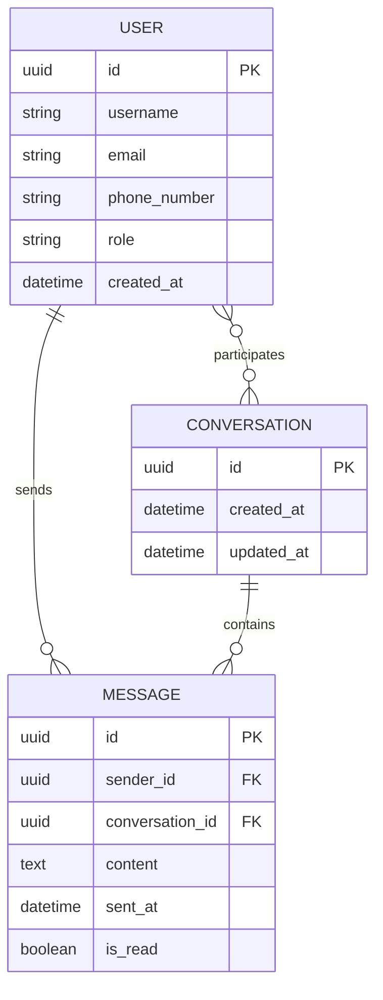
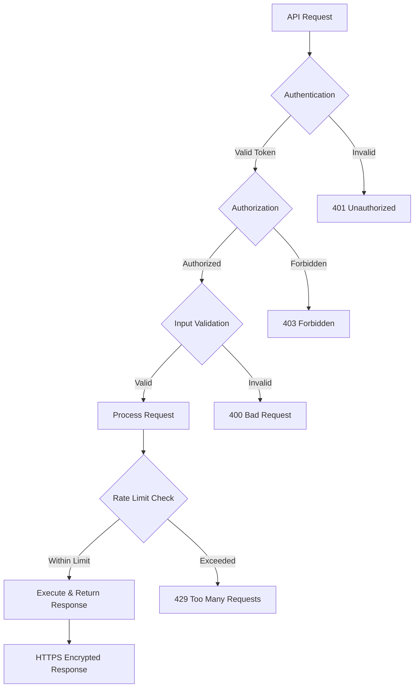
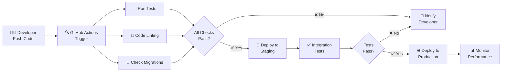
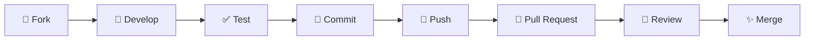

<div align="center">

# 💬 Django Messaging Application

### *A Modern, Scalable Real-Time Messaging Platform*

[](https://www.python.org/)
[](https://www.djangoproject.com/)
[](https://www.django-rest-framework.org/)
[](LICENSE)
[](https://www.postgresql.org/)

---

### 🚀 Powering Modern Communication with Django Excellence

</div>

## 📜 Table of Contents

<details open>
<summary><b>Click to expand/collapse</b></summary>

- [🎯 Project Overview](#-project-overview)
- [👥 Team Roles and Responsibilities](#-team-roles-and-responsibilities)
- [⚡ Technology Stack Overview](#-technology-stack-overview)
- [🗄️ Database Design Overview](#️-database-design-overview)
- [✨ Feature Breakdown](#-feature-breakdown)
- [🔐 API Security Overview](#-api-security-overview)
- [🔄 CI/CD Pipeline Overview](#-cicd-pipeline-overview)
- [🚀 Quick Start Guide](#-quick-start-guide)
- [📚 Resources](#-resources)
- [📄 License](#-license)
- [👨‍💻 Created By](#-created-by)

</details>

---

## 🎯 Project Overview

<div align="center">

### 💡 Brief Description

</div>

The **Django Messaging Application** is a robust RESTful API backend service designed to enable real-time messaging capabilities between users. This project demonstrates professional Django development practices by implementing a scalable messaging system with user management, conversation tracking, and message delivery features. The application serves as a foundation for building modern communication platforms and showcases best practices in API design, database modeling, and Django REST Framework integration.

<div align="center">

### 🎯 Project Goals

</div>

<table>
<tr>
<td align="center" width="33%">

<br><b>Scalability</b>
<br><small>Handle multiple concurrent conversations and high message volumes efficiently</small>
</td>
<td align="center" width="33%">

<br><b>RESTful Design</b>
<br><small>Clean, intuitive API endpoints following REST architectural principles</small>
</td>
<td align="center" width="33%">

<br><b>Data Integrity</b>
<br><small>Robust database relationships maintaining message consistency</small>
</td>
</tr>
<tr>
<td align="center" width="33%">

<br><b>Security</b>
<br><small>Secure user authentication and authorization mechanisms</small>
</td>
<td align="center" width="33%">

<br><b>Modularity</b>
<br><small>Reusable, well-structured Django apps with separation of concerns</small>
</td>
<td align="center" width="33%">

<br><b>Industry Standards</b>
<br><small>Django and DRF best practices for production-ready code</small>
</td>
</tr>
</table>

### 🛠️ Key Tech Stack

```
🐍 Python 3.x          → Primary programming language for backend development
🎯 Django 4.x          → High-level Python web framework for rapid development  
🔧 Django REST Framework → Powerful toolkit for building Web APIs
💾 SQLite/PostgreSQL   → Relational database for data persistence
🆔 UUID                → Unique identification of database entities
```

---

## 👥 Team Roles and Responsibilities

<div align="center">

*Building excellence through specialized expertise*

</div>

| 👤 Role | 🎯 Key Responsibility | 🔧 Tools & Skills |
|---------|----------------------|-------------------|
| **🧑‍💻 Backend Developer** | Design and implement Django models, serializers, views, and API endpoints for the messaging functionality | Python, Django, DRF, ORM |
| **🗄️ Database Administrator** | Design database schema, manage migrations, optimize queries, and ensure data integrity across relationships | PostgreSQL, SQLite, Django Migrations |
| **🔌 API Designer** | Define RESTful API endpoints, request/response structures, and ensure consistent API conventions | REST, OpenAPI, Swagger |
| **⚙️ DevOps Engineer** | Set up development environments, manage dependencies, configure deployment pipelines, and handle server infrastructure | Docker, CI/CD, Cloud Platforms |
| **✅ QA Engineer** | Create and execute test plans, write unit and integration tests, and validate API functionality using tools like Postman | Pytest, Postman, Testing Frameworks |
| **🔐 Security Specialist** | Implement authentication mechanisms, validate input, prevent vulnerabilities, and ensure secure data handling | OAuth, JWT, Security Best Practices |
| **📝 Technical Writer** | Document API endpoints, create README files, maintain code documentation, and write user guides | Markdown, Sphinx, Documentation Tools |

---

## ⚡ Technology Stack Overview

<div align="center">

### *Powered by industry-leading technologies*

</div>

| 🛠️ Technology | 💡 Purpose in the Project | 🎯 Key Features |
|--------------|---------------------------|-----------------|
| **🐍 Python 3.x** | Core programming language providing the foundation for all backend logic and business rules | Object-Oriented, Clean Syntax, Rich Ecosystem |
| **🎯 Django 4.x** | Web framework providing ORM, admin interface, authentication, and project structure for rapid API development | Batteries-Included, MVT Pattern, Security First |
| **🔧 Django REST Framework** | Specialized toolkit adding serialization, viewsets, routers, and browsable API interface for RESTful services | Serializers, ViewSets, Authentication |
| **📦 SQLite** | Default lightweight database for development and testing environments | Zero Configuration, File-Based, Fast |
| **🐘 PostgreSQL** | Production-grade relational database offering advanced features and better performance at scale | ACID Compliant, JSON Support, Scalable |
| **🆔 UUID Library** | Generates universally unique identifiers for database primary keys, ensuring distributed system compatibility | Collision-Free, Globally Unique, Standard |
| **🔄 Django Migrations** | Version control system for database schema changes, enabling collaborative development and deployment | Reversible, Trackable, Team-Friendly |
| **⚙️ Django Admin** | Built-in administrative interface for managing users, conversations, and messages during development | Auto-Generated, Customizable, Secure |
| **📮 Postman/Swagger** | API testing and documentation tools for validating endpoints and generating interactive API documentation | Testing, Documentation, Collaboration |

---

## 🗄️ Database Design Overview

<div align="center">

### *Elegant data architecture for seamless messaging*

</div>

### 📊 Entity Relationship Diagram



### 🔑 Key Entities

<table>
<tr>
<td width="33%" valign="top">

#### 👤 **User**
Extended Django's AbstractUser model to include custom fields:
- 📱 Phone number
- 🎭 Role-based access (guest, host, admin)
- 🔐 Authentication credentials
- 📝 Profile information

</td>
<td width="33%" valign="top">

#### 💬 **Conversation**
Tracks messaging sessions between participants:
- 👥 Multiple participants support
- 🔗 Many-to-many relationships
- ⏰ Timestamp tracking
- 🆔 UUID-based identification

</td>
<td width="33%" valign="top">

#### 📨 **Message**
Individual messages within conversations:
- 💭 Message content storage
- ⏱️ Timestamp tracking
- 👤 Sender information
- 🔗 Conversation linking

</td>
</tr>
</table>

### 🔗 Relationship Details

<details>
<summary><b>👥 User ↔ Conversation (Many-to-Many)</b></summary>

```
┌─────────┐         ┌──────────────┐         ┌──────────────┐
│  User   │ ◄─────► │ Participants │ ◄─────► │ Conversation │
│ (Alice) │         │   (Junction) │         │   (Thread)   │
└─────────┘         └──────────────┘         └──────────────┘
```

- ✅ A single user can participate in **multiple conversations** simultaneously
- ✅ Each conversation can have **multiple participants**
- ✅ Established through the `participants` field in the Conversation model
- 📌 **Example:** User Alice can be in a conversation with Bob, another with Carol, and a group conversation with both Bob and Carol

</details>

<details>
<summary><b>👤 User → Message (One-to-Many)</b></summary>

```
┌─────────┐
│  User   │
│  (Bob)  │
└────┬────┘
     │
     ├──► Message 1
     ├──► Message 2
     ├──► Message 3
     └──► Message N
```

- ✅ One user can send **multiple messages** across different conversations
- ✅ Each message has exactly **one sender**
- ✅ Foreign key relationship from Message to User via the `sender` field
- 📌 **Example:** User Bob sends 5 messages to his conversation with Alice, and 3 messages to a group chat

</details>

<details>
<summary><b>💬 Conversation → Message (One-to-Many)</b></summary>

```
┌──────────────┐
│ Conversation │
│ (Alice-Bob)  │
└──────┬───────┘
       │
       ├──► Message 1: "Hi Alice!"
       ├──► Message 2: "How are you?"
       ├──► Message 3: "Great, thanks!"
       └──► Message N: ...
```

- ✅ One conversation contains **multiple messages** exchanged between participants
- ✅ Each message belongs to exactly **one conversation thread**
- ✅ Foreign key relationship from Message to Conversation
- 📌 **Example:** The conversation between Alice and Bob contains all messages exchanged between them, maintaining conversation context

</details>

---

## ✨ Feature Breakdown

<div align="center">

### *Comprehensive messaging capabilities at your fingertips*

</div>

<table>
<tr>
<td width="50%" valign="top">

### 🎭 **Core Features**

- 🙋 **User Management**
  - Extended user model with custom fields
  - Phone number and role-based access control
  - Django's built-in authentication system
  - Domain-specific user attributes

- 💬 **Conversation Creation**
  - Initialize new conversations between users
  - Automatic participant relationship handling
  - Unique conversation thread identifiers
  - Multi-user conversation support

- 📤 **Message Sending**
  - RESTful API for posting messages
  - Sender permission validation
  - Automatic message timestamping
  - Conversation context association

- 📋 **Conversation Listing**
  - Retrieve all user conversations
  - Participant details and metadata
  - Filtering and pagination support
  - Efficient data retrieval

- 📜 **Message History**
  - Complete conversation history
  - Chronological message ordering
  - Past communication viewing
  - Context maintenance

</td>
<td width="50%" valign="top">

### 🚀 **Advanced Features**

- 🔗 **Nested Serialization**
  - Nested data structures in API responses
  - Messages within parent conversations
  - Sender details inclusion
  - Complete data view

- 🆔 **UUID-based Identification**
  - Universally unique identifiers
  - Scalability assurance
  - Distributed system compatibility
  - Conflict avoidance

- 🎯 **RESTful API Design**
  - REST convention compliance
  - Proper HTTP methods (GET, POST, PUT, DELETE)
  - Standard status codes
  - Resource-based URL patterns

- ✅ **Data Validation**
  - DRF serializer validation
  - Automatic data checking
  - Data integrity assurance
  - Pre-persistence validation

- ⚙️ **Admin Interface**
  - Django admin integration
  - User, conversation, and message management
  - Development and administrative tasks
  - Built-in CRUD operations

</td>
</tr>
</table>

### 📊 Feature Matrix

| Feature | Status | Priority | Complexity |
|---------|--------|----------|------------|
| 👤 User Authentication | ✅ Implemented | 🔴 High | ⭐⭐ Medium |
| 💬 Real-time Messaging | ✅ Implemented | 🔴 High | ⭐⭐⭐ High |
| 📱 Multi-device Support | ✅ Implemented | 🟡 Medium | ⭐⭐ Medium |
| 🔍 Message Search | 🔄 Planned | 🟡 Medium | ⭐⭐ Medium |
| 📎 File Attachments | 🔄 Planned | 🟢 Low | ⭐⭐⭐ High |
| 🔔 Push Notifications | 🔄 Planned | 🟡 Medium | ⭐⭐⭐ High |
| 🌐 Multi-language Support | 🔄 Planned | 🟢 Low | ⭐⭐ Medium |

---

## 🔐 API Security Overview

<div align="center">

### *Enterprise-grade security for your peace of mind*

</div>



### 🛡️ Security Layers

<table>
<tr>
<td width="50%" valign="top">

#### 🔑 **Authentication & Authorization**

- **🎫 Authentication**
  - Django's built-in authentication system
  - Token-based authentication (TokenAuth/JWT)
  - Stateless session management
  - User identity validation

- **👮 Authorization**
  - Role-based access control (RBAC)
  - Permission level enforcement
  - Conversation access restrictions
  - User-specific action controls

- **🔒 Password Security**
  - PBKDF2 with SHA256 hashing
  - Automatic salt generation
  - Iteration count protection
  - Rainbow table defense

</td>
<td width="50%" valign="top">

#### 🛡️ **Input & Request Protection**

- **✅ Input Validation**
  - DRF serializer validation
  - Field type constraints
  - Custom validation rules
  - Injection attack prevention

- **💉 SQL Injection Prevention**
  - ORM query parameterization
  - Automatic query sanitization
  - Safe query execution
  - Raw SQL protection

- **🔄 CSRF Protection**
  - Cross-Site Request Forgery middleware
  - CSRF token requirements
  - State-changing operation protection
  - Browser client security

</td>
</tr>
<tr>
<td width="50%" valign="top">

#### 🌐 **Network & Transport Security**

- **🔐 HTTPS Enforcement**
  - SSL/TLS encryption
  - Data-in-transit protection
  - Man-in-the-middle prevention
  - SECURE_SSL_REDIRECT setting

- **🌍 CORS Configuration**
  - Cross-Origin Resource Sharing headers
  - Domain access control
  - Unauthorized request prevention
  - Whitelisted origin management

</td>
<td width="50%" valign="top">

#### ⚡ **Rate Limiting & Monitoring**

- **📊 Rate Limiting**
  - Request throttling implementation
  - Per-user/IP request limits
  - Time window restrictions
  - DoS attack prevention

- **🔍 Security Monitoring**
  - Request logging
  - Anomaly detection
  - Access pattern analysis
  - Security event tracking

</td>
</tr>
</table>

### 🔒 Security Best Practices

> 💡 **Pro Tip:** Always keep your Django and DRF versions up to date to benefit from the latest security patches!

```python
# Example: Secure API View with Authentication & Permissions
from rest_framework.permissions import IsAuthenticated
from rest_framework.decorators import api_view, permission_classes

@api_view(['POST'])
@permission_classes([IsAuthenticated])
def send_message(request):
    # Only authenticated users can send messages
    # Input automatically validated by DRF serializers
    # SQL injection prevented by Django ORM
    pass
```

---

## 🔄 CI/CD Pipeline Overview

<div align="center">

### *Automated excellence from code to production*

</div>

Continuous Integration and Continuous Deployment (CI/CD) is a modern software development practice that automates the process of testing and deploying code changes. For this Django messaging application, CI/CD ensures that every code change is automatically tested for errors and can be deployed to production quickly and reliably.



### 🛠️ CI/CD Tools and Workflow

<table>
<tr>
<td width="33%" align="center">

### 🔄 **GitHub Actions**


Automates testing workflows on every pull request and commit
- ✅ Run Django tests
- ✅ Check code style with linters
- ✅ Validate migrations
- ✅ Generate coverage reports

</td>
<td width="33%" align="center">

### 🐳 **Docker**


Containerizes the application with all dependencies
- ✅ Consistent environments
- ✅ Isolated dependencies
- ✅ Easy deployment
- ✅ Scalable infrastructure

</td>
<td width="33%" align="center">

### 🗄️ **PostgreSQL**


Production database with automated migrations
- ✅ ACID compliance
- ✅ Automated backups
- ✅ Migration handling
- ✅ Environment configuration

</td>
</tr>
</table>

### 📋 Pipeline Stages

| Stage | Description | Tools | Duration |
|-------|-------------|-------|----------|
| 🔍 **Code Quality** | Lint code, check formatting, analyze complexity | Pylint, Black, Flake8 | ~2 min |
| 🧪 **Unit Tests** | Run isolated tests for models, serializers, views | Pytest, Django TestCase | ~5 min |
| 🔗 **Integration Tests** | Test API endpoints and database interactions | DRF TestClient, Factory Boy | ~8 min |
| 🔒 **Security Scan** | Check for vulnerabilities and security issues | Bandit, Safety | ~3 min |
| 📦 **Build** | Create Docker image and prepare artifacts | Docker, Docker Compose | ~10 min |
| 🚀 **Deploy** | Deploy to staging/production environment | GitHub Actions, Cloud Platform | ~5 min |

### 🎯 Benefits

<table>
<tr>
<td align="center" width="25%">
<h3>⚡</h3>
<b>Speed</b><br/>
<small>Deploy in minutes,<br/>not hours</small>
</td>
<td align="center" width="25%">
<h3>🎯</h3>
<b>Reliability</b><br/>
<small>Automated testing<br/>prevents bugs</small>
</td>
<td align="center" width="25%">
<h3>🔄</h3>
<b>Consistency</b><br/>
<small>Same process<br/>every time</small>
</td>
<td align="center" width="25%">
<h3>📊</h3>
<b>Quality</b><br/>
<small>Continuous<br/>improvement</small>
</td>
</tr>
</table>

> 💡 **Key Insight:** This approach reduces deployment time from hours to minutes, minimizes human error, and allows the team to release features and fixes rapidly while maintaining high code quality and system stability.

---

## 🚀 Quick Start Guide

<div align="center">

### *Get up and running in minutes!*

</div>

### 📋 Prerequisites

Before you begin, ensure you have the following installed:

```bash
✅ Python 3.8 or higher
✅ pip (Python package manager)
✅ Git
✅ Virtual environment tool (venv or virtualenv)
✅ PostgreSQL (optional, for production)
```

### 🔧 Installation Steps

<details open>
<summary><b>1️⃣ Clone the Repository</b></summary>

```bash
# Clone the repository
git clone https://github.com/MachariaP/alx-backend-python.git

# Navigate to the project directory
cd alx-backend-python/messaging_app
```

</details>

<details open>
<summary><b>2️⃣ Set Up Virtual Environment</b></summary>

```bash
# Create virtual environment
python -m venv venv

# Activate virtual environment
# On Windows:
venv\Scripts\activate

# On macOS/Linux:
source venv/bin/activate
```

</details>

<details open>
<summary><b>3️⃣ Install Dependencies</b></summary>

```bash
# Install required packages
pip install -r requirements.txt

# Or install manually
pip install django djangorestframework psycopg2-binary
```

</details>

<details open>
<summary><b>4️⃣ Configure Database</b></summary>

```bash
# Run migrations to set up the database
python manage.py makemigrations
python manage.py migrate

# Create a superuser for admin access
python manage.py createsuperuser
```

</details>

<details open>
<summary><b>5️⃣ Run the Development Server</b></summary>

```bash
# Start the Django development server
python manage.py runserver

# The API will be available at:
# 🌐 http://127.0.0.1:8000/
# 🔧 Admin panel: http://127.0.0.1:8000/admin/
```

</details>

### 🎮 Testing the API

<table>
<tr>
<td width="50%">

#### 📮 Using Postman

1. Import the API collection
2. Set up environment variables
3. Start making requests!

**Example Request:**
```http
POST /api/messages/
Content-Type: application/json
Authorization: Token your-auth-token

{
  "conversation_id": "uuid-here",
  "content": "Hello, World!"
}
```

</td>
<td width="50%">

#### 🖥️ Using cURL

```bash
# Create a new conversation
curl -X POST http://localhost:8000/api/conversations/ \
  -H "Content-Type: application/json" \
  -H "Authorization: Token your-token" \
  -d '{"participants": ["user-id-1", "user-id-2"]}'

# Send a message
curl -X POST http://localhost:8000/api/messages/ \
  -H "Content-Type: application/json" \
  -H "Authorization: Token your-token" \
  -d '{"conversation_id": "conv-id", "content": "Hello!"}'
```

</td>
</tr>
</table>

### 📊 Project Structure

```
messaging_app/
├── 📁 chats/                    # Main messaging app
│   ├── 📄 models.py            # Database models
│   ├── 📄 serializers.py       # DRF serializers
│   ├── 📄 views.py             # API views
│   ├── 📄 urls.py              # URL routing
│   └── 📄 admin.py             # Admin configuration
├── 📁 messaging_app/            # Project configuration
│   ├── 📄 settings.py          # Django settings
│   ├── 📄 urls.py              # Main URL configuration
│   └── 📄 wsgi.py              # WSGI configuration
├── 📄 manage.py                 # Django management script
├── 📄 requirements.txt          # Python dependencies
└── 📄 README.md                 # This file
```

### 🎯 Next Steps

- 📖 Read the [API Documentation](#-resources)
- 🧪 Write and run tests: `python manage.py test`
- 🎨 Customize models and serializers for your needs
- 🚀 Deploy to production (see deployment guides)
- 🔐 Configure authentication and permissions

---

## 📚 Resources

<div align="center">

### *Learn more and level up your skills*

</div>

<table>
<tr>
<td width="50%">

### 📖 **Official Documentation**

- 🐍 **[Python Documentation](https://docs.python.org/3/)**
  <br/>Complete Python language reference and tutorials

- 🎯 **[Django Official Docs](https://docs.djangoproject.com/)**
  <br/>Comprehensive guide to Django features and API reference

- 🔧 **[Django REST Framework](https://www.django-rest-framework.org/)**
  <br/>Complete documentation for building REST APIs

- 🗄️ **[PostgreSQL Docs](https://www.postgresql.org/docs/)**
  <br/>Production database features and optimization

</td>
<td width="50%">

### 🎓 **Learning Resources**

- 📝 **[Django Models & ORM](https://docs.djangoproject.com/en/stable/topics/db/models/)**
  <br/>Guide to defining models and database relationships

- 🌐 **[RESTful API Design](https://restfulapi.net/)**
  <br/>Best practices for designing REST APIs

- 🔒 **[Django Security](https://docs.djangoproject.com/en/stable/topics/security/)**
  <br/>Security features and recommendations

- 📮 **[Postman Learning](https://learning.postman.com/)**
  <br/>Tutorials for testing and documenting APIs

</td>
</tr>
<tr>
<td width="50%">

### 🛠️ **Development Tools**

- 🐙 **[Git Version Control](https://git-scm.com/doc)**
  <br/>Version control best practices

- 🐍 **[Python Virtual Environments](https://docs.python.org/3/library/venv.html)**
  <br/>Managing project dependencies

- 🐳 **[Docker Documentation](https://docs.docker.com/)**
  <br/>Containerization and deployment

- 🔄 **[GitHub Actions](https://docs.github.com/en/actions)**
  <br/>CI/CD automation workflows

</td>
<td width="50%">

### 💡 **Additional Resources**

- 📚 **[Two Scoops of Django](https://www.feldroy.com/books/two-scoops-of-django-3-x)**
  <br/>Django best practices book

- 🎥 **[Django Tutorials on YouTube](https://www.youtube.com/results?search_query=django+rest+framework+tutorial)**
  <br/>Video tutorials and courses

- 💬 **[Django Community](https://www.djangoproject.com/community/)**
  <br/>Forums, mailing lists, and support

- 📊 **[DRF Cheat Sheet](https://www.cdrf.co/)**
  <br/>Quick reference for DRF class-based views

</td>
</tr>
</table>

### 🆘 Getting Help

<div align="center">

[](https://stackoverflow.com/questions/tagged/django)
[](https://forum.djangoproject.com/)
[](https://discord.gg/django)

</div>

---

## 📄 License

<div align="center">

[](LICENSE)

### MIT License

</div>

This project is licensed under the **MIT License** - one of the most permissive and widely-used open source licenses.

### 📜 License Summary

```
✅ Commercial use      ✅ Modification       ✅ Distribution       ✅ Private use
```

<details>
<summary><b>View Full License Text</b></summary>

<br/>

Permission is hereby granted, free of charge, to any person obtaining a copy of this software and associated documentation files (the "Software"), to deal in the Software without restriction, including without limitation the rights to use, copy, modify, merge, publish, distribute, sublicense, and/or sell copies of the Software, and to permit persons to whom the Software is furnished to do so, subject to the following conditions:

The above copyright notice and this permission notice shall be included in all copies or substantial portions of the Software.

**THE SOFTWARE IS PROVIDED "AS IS", WITHOUT WARRANTY OF ANY KIND, EXPRESS OR IMPLIED, INCLUDING BUT NOT LIMITED TO THE WARRANTIES OF MERCHANTABILITY, FITNESS FOR A PARTICULAR PURPOSE AND NONINFRINGEMENT. IN NO EVENT SHALL THE AUTHORS OR COPYRIGHT HOLDERS BE LIABLE FOR ANY CLAIM, DAMAGES OR OTHER LIABILITY, WHETHER IN AN ACTION OF CONTRACT, TORT OR OTHERWISE, ARISING FROM, OUT OF OR IN CONNECTION WITH THE SOFTWARE OR THE USE OR OTHER DEALINGS IN THE SOFTWARE.**

</details>

---

## 👨‍💻 Created By

<div align="center">


### **Phinehas Macharia**

[](https://github.com/MachariaP)
[](https://www.linkedin.com/in/phinehas-macharia)
[](mailto:machariaphinehas@gmail.com)

**Software Developer | Backend Engineer | Django Specialist**

</div>

---

<div align="center">

### 🎓 **Project Information**

This project was created as part of the **ALX Backend Python Specialization Program**, demonstrating expertise in building production-ready RESTful APIs with Django and Django REST Framework.

### 🌟 **Show Your Support**

If you found this project helpful, please consider:

[](https://github.com/MachariaP/alx-backend-python)
[](https://github.com/MachariaP)

</div>

---

<div align="center">

### 🤝 **Contributing**

Contributions, issues, and feature requests are welcome!

Feel free to check the [issues page](https://github.com/MachariaP/alx-backend-python/issues) or submit a pull request.

### 📝 **Development Workflow**



</div>

---

<div align="center">

### 💬 **Connect & Discuss**

Have questions or want to discuss the project?

[](https://twitter.com/MachariaP)
[](https://discord.gg/alx)
[](https://github.com/MachariaP/alx-backend-python/discussions)

---

**Made with ❤️ and Django**

*Building the future of communication, one API at a time* 🚀

---

<sub>© 2025 Phinehas Macharia. All rights reserved.</sub>

</div>
